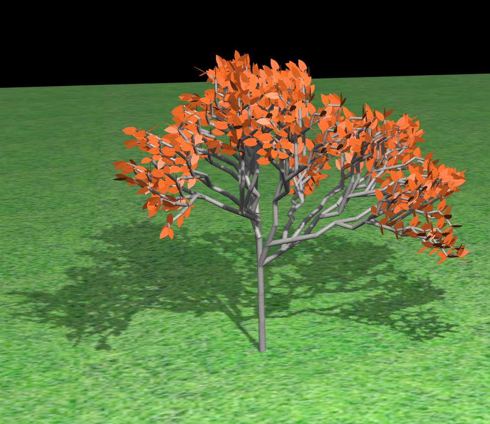
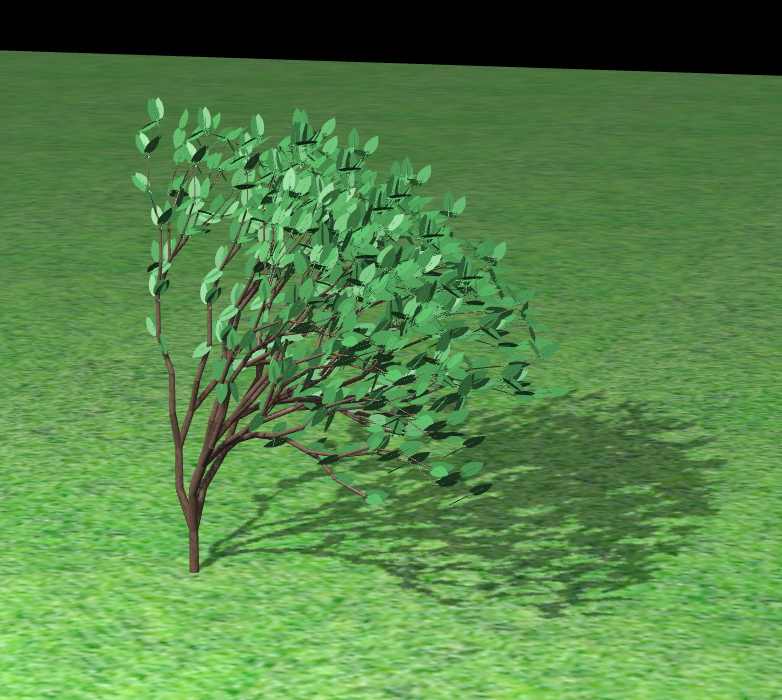
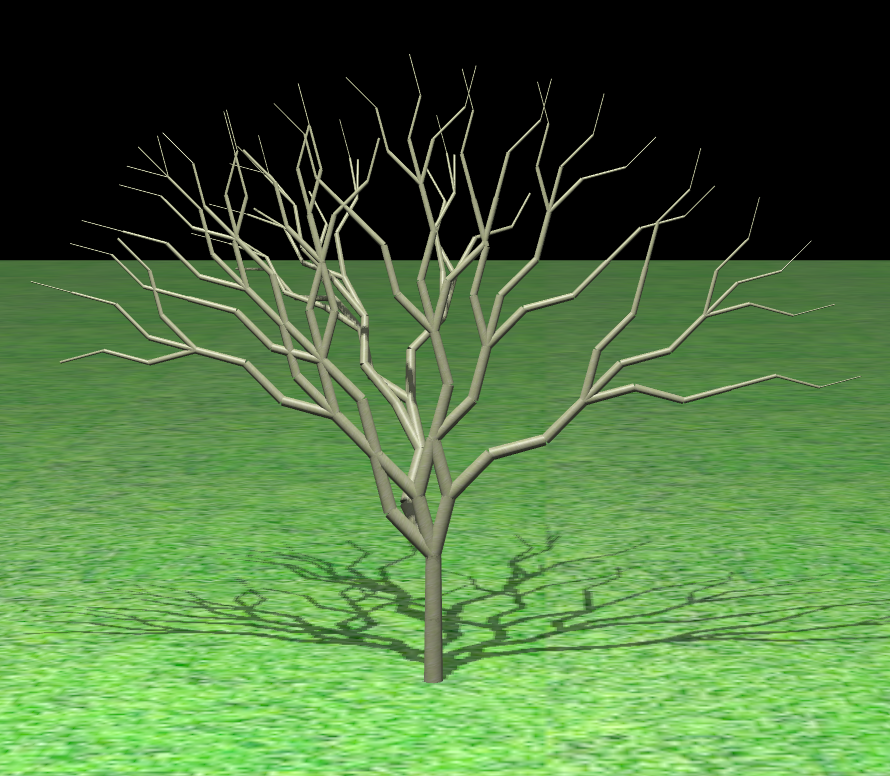
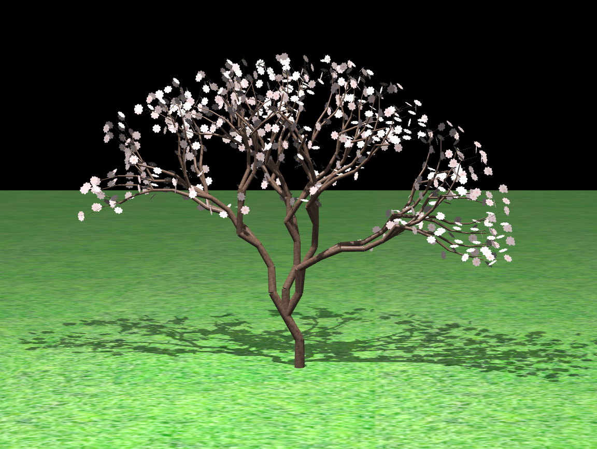
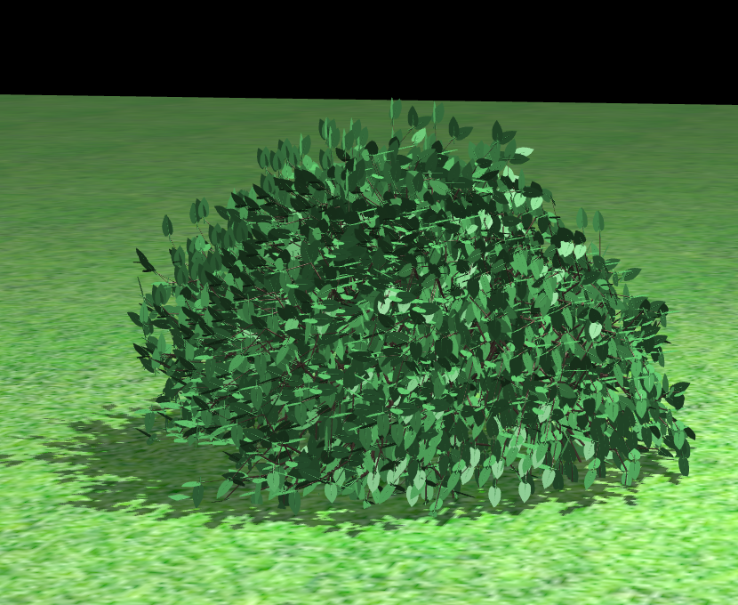

# L-System-Trees
### An interactive garden where you can create your based L-System trees.

This software provides a 3D real time rendering of a garden, where put trees or bushes.
It is based on **Lindenmayer System**, that consists of an alphabet _simbols_ with some _production rules_. Algorithm 
starts with an _axiom_ and expands rules iterations-times. The generated strings are converted into 
*geometric structures*, branches in our case. The tree generated has a **fractal branch scheme**.

It was written in Javascript with [Three.js](https://threejs.org) framework, which is based on **WebGL** API.

</img>

### How to install

Download code and run `index.html` with a browser. In Chrome local mode, make sure to turn on the 
`-allow-file-access-from-files` flag or run it with local server (best solution) to load textures.

It is recommended to have dedicated GPU to render more trees. Code tested with Firefox and Chrome.

### How to make it work

In this demo, you can:

- Choose a **ground point** with mouse click;
- Select the complete tree **Grammar**, in particular the _axiom_ and two _production rules_.
- Complete **tree parameters**, like _branch length_, _branch radius_, _branch angle_ and so on.
- Choose **some fancy tree features**, like season and different textures.
- Render with the button.
- Eventually, you can use 5 preset different type trees.

</img>
</img>
</img>
</img>

### References

[1] <i>Przemyslaw Prusinkiewicz and Aristid Lindenmayer</i>, The Algorithmic Beauty of Plants, 2004.

[2] https://en.wikipedia.org/wiki/L-system

[3] http://www.carl-olsson.com/project/l-system/

